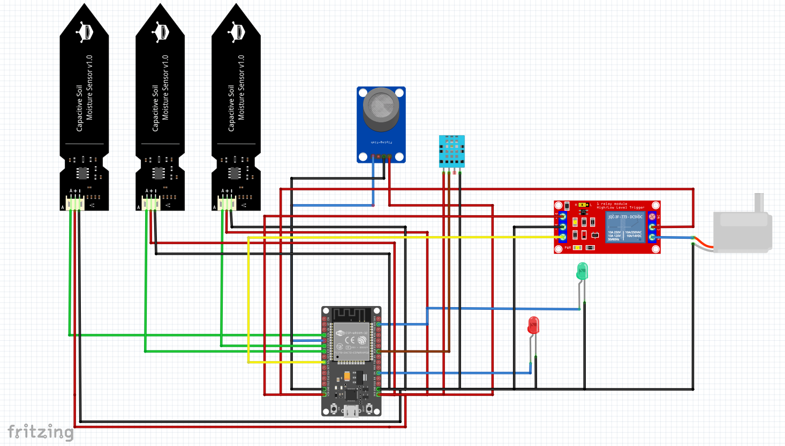
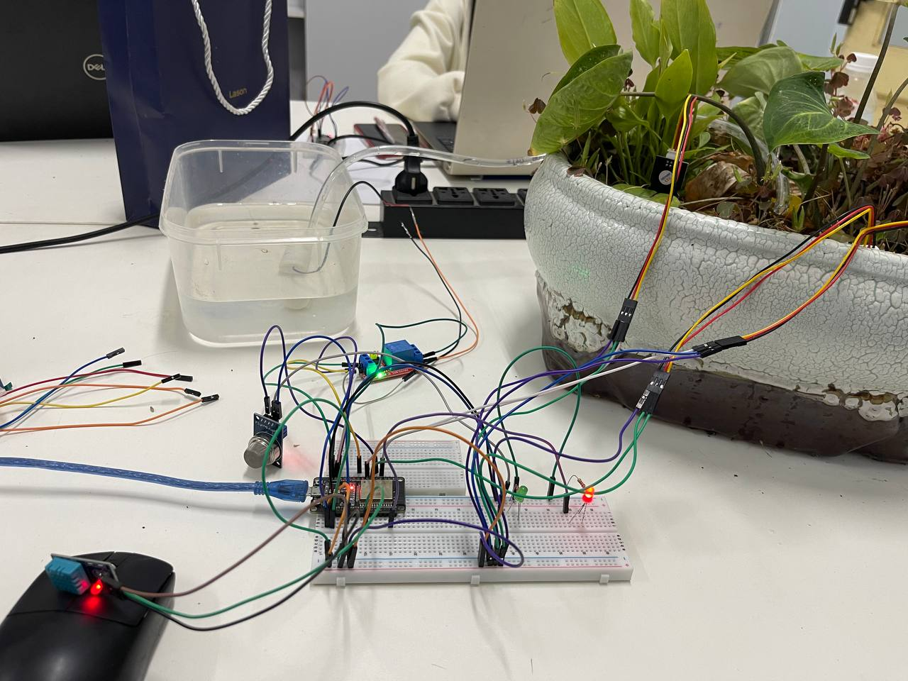
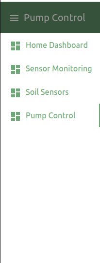
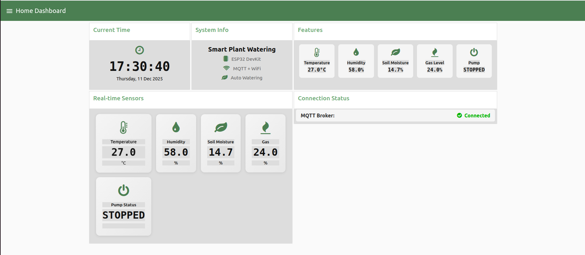
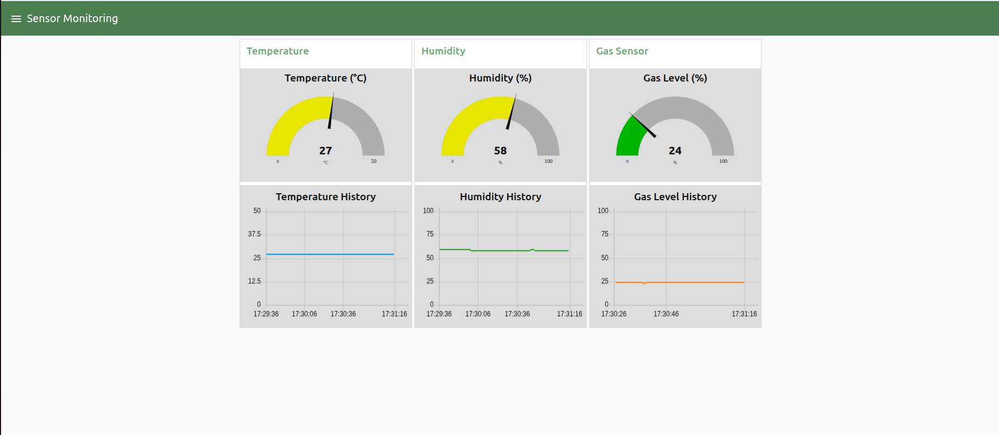
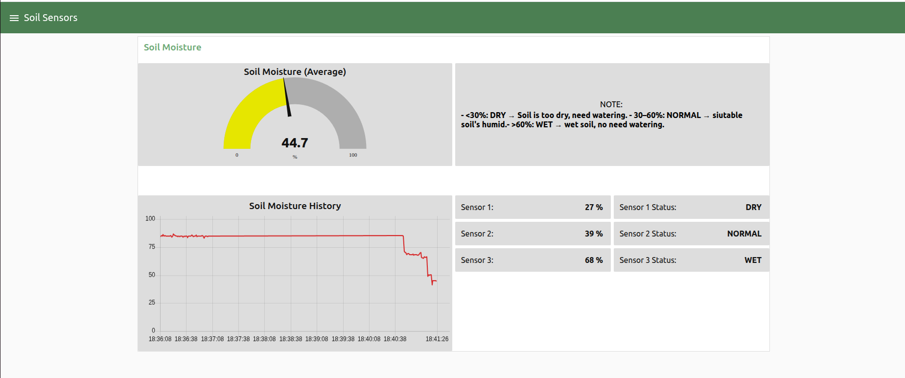

# HỆ THỐNG TƯỚI CÂY THÔNG MINH DÙNG ESP32 & MQTT

## Đặt vấn đề
__Bài toán đặt ra__
- Nhiều người trồng cây (trong nhà, ban công, vườn nhỏ, mô hình thủy canh, v.v.) thường không có thời gian theo dõi độ ẩm đất và tưới nước thường xuyên. Việc tưới quá tay hoặc quên tưới đều có thể làm cây kém phát triển hoặc chết.

- Hệ thống trong dự án này dùng ESP32 kết hợp các cảm biến để:
    + Đo nhiệt độ, độ ẩm không khí (DHT11).
    + Đo khí gas (MQ2).
    + Đo độ ẩm đất tại 3 vị trí khác nhau.
    + Điều khiển bơm nước qua relay theo chế độ tự động (dựa trên độ ẩm đất) hoặc bằng tay qua MQTT / Dashboard.
    + Gửi dữ liệu cảm biến và trạng thái bơm lên MQTT Broker (EMQX) để hiển thị và điều khiển trên Node-RED hoặc ứng dụng khác.

__Mục tiêu__
- Giảm công tưới tay, đảm bảo cây luôn được tưới vừa đủ.
- Có thể theo dõi trạng thái hệ thống từ xa qua mạng WiFi.

---

# Nội dung chính

1. Phần cứng
- Vi điều khiển: ESP32DOIT-DEVKIT-V1.
- Cảm biến:
    + 01 x DHT11: đo nhiệt độ và độ ẩm không khí.
    + 03 x Cảm biến độ ẩm đất (analog).
    + 01 x MQ2 : đo khí gas (analog).
- Chấp hành:
    + 01 x Relay điều khiển bơm nước.
    + 02 x LED trạng thái.
- Khác:
    + Nguồn 5V/3.3V phù hợp cho ESP32, relay và cảm biến.
    + Dây nối, breadboard / PCB mô hình.

2. Phần mềm
- Node-red:
    + Hiển thị độ ẩm đất của mẫu khảo sát.
    + Điều khiển việc bật/tắt bơm thủ công hoặc tự động.
- MQTT Broker: EMQX
- Phần mềm phát triển: Platform.IO

# Sơ đồ chân kết nối:
1. Sơ đồ pin:
Sơ đồ được mô phỏng trên Fritzing.

Bảng kết nối với ESP32: 
| Devices        |  Pin          | ESP32         |
|----------------|---------------|---------------|
| **Relay**      | DC+, COM      | 5V            |
|                | DC-           | GND           |
|                | In            | 26            |
| **Soil Sensor**| Vcc           | 3.3V          |
|                | GND           | GND           |
| Soil 1         | AOUT          | 32            |
| Soil 2         | AOUT          | 33            |
| Soil 3         | AOUT          | 34            |
|                |               |               |
| **DHT**        | VCC           | 3.3V          |
|                | GND           | GND           |
|                | DATA          | 18            |
| **MQ-2**       | VCC           | 3.3V          |
|                | GND           | GND           |
|                | AO            | 35            |
| **Bơm DC 5V**  | -             | GND           |
| **LED**        | LED 1         | 4             |
|                | LED 2         | 22            |

## Kết quả
1. Mô hình: 

2. Node-red-dashboard:
- Dashboard của Node-red bao gồm 4 phần chính: Home Dashboard, Sensor Monitoring, Soil Sensors và Pump Control

- Giao diện **Home Dashboard** hiển thị các giá trị cảm biến, giờ hiện tại( múi giờ VN), và trạng thái kết nối MQTT.
  

- Giao diện **Sensor Monitoring** được sử dụng để hiện thị các giá trị cảm biến DHT11 và MQ-2

- Giao diện **Soil Sensors** hiển thị giá trị của 3 cảm biến độ ẩm đất, dựa vào đó tính được giá trị trung bình. Ngoài ra dựa vào ngưỡng đã được thiết lập trước, người dùng có thể biết cảm biến đang ở trạng thái nào để tùy chỉnh cách dùng.

- Giao diện **Pump Control** chứa các nút chức năng sẽ quyết định trạng thái của bơm. Ngoài ra còn có 2 thanh tiến độ thể hiện thời gian bơm cố định 10s 1 lần và thời gian nghỉ giữa 2 lần bơm là 6s.

## Kết luận

- Chức năng đã đạt được:
    + Đọc và gửi dữ liệu: nhiệt độ, độ ẩm không khí,khí gas, độ ẩm đất 3 điểm, độ ẩm trung bình qua MQTT.
    + Điều khiển bơm nước tự động theo ngưỡng độ ẩm đất hoặc bằng tay qua topic MQTT.
    + Bảo vệ bơm bằng thời gian chạy tối đa và thời gian nghỉ tối thiểu.
    + Cấu trúc mã tách rõ phần kết nối WiFi, MQTT và xử lý logic.

- Có thể mở rộng thêm:
    + Lưu log dữ liệu vào InfluxDB / TimescaleDB để phân tích lâu dài.
    + Thêm nhiều zone tưới khác nhau với nhiều relay/bơm.

